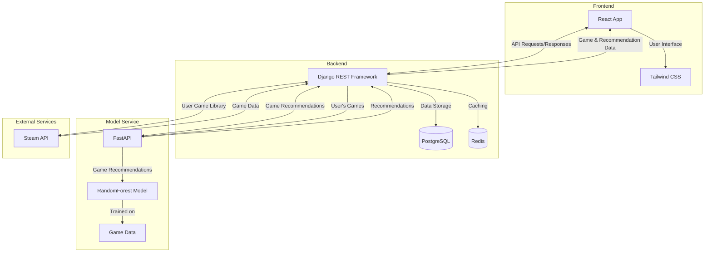

<h1 align="center">Get Ur Game!!!</h1>

<p align="center">
  
  
  
  
  
  
  
  
</p>

## Table of Contents

- [Overview](#overview)
- [Features](#features)
- [Architecture](#architecture)
- [Technologies](#technologies)
  - [Backend](#backend)
    - [Technologies](#technologies-1)
  - [Frontend](#frontend)
    - [Technologies](#technologies-2)
- [Setup & Installation](#setup--installation)

## Overview
**Get Ur Game!!!** is a game recommendation system that personalizes suggestions based on a user’s Steam library. The project includes both a frontend and backend to handle user interaction and provide recommendations.

---

## Features

- Fetches user’s owned games from Steam
- RandomForest-based recommendation engine
- Backend APIs with Django REST and FastAPI
- Redis caching for performance
- Dockerized setup for easy deployment
- Beautiful frontend with React + Tailwind CSS

---

## Architecture

The following diagram illustrates the architecture of the GetUrGame system:



The architecture consists of four main components:

1. **Frontend**: A React application with Tailwind CSS for styling that provides the user interface.
2. **Backend**: A Django REST Framework application that handles user authentication, session management, and communication with the Steam API and Model Service.
3. **Model Service**: A FastAPI application that uses a RandomForest model to generate game recommendations based on the user's game library.
4. **External Services**: The Steam API, which provides user game library data.

Data flows through the system as follows:
- The user interacts with the React frontend
- The frontend communicates with the Django backend
- The backend authenticates with Steam and retrieves the user's game library
- The backend sends the user's game library to the Model Service
- The Model Service generates recommendations and returns them to the backend
- The backend sends the recommendations to the frontend for display

---

## Technologies

### Backend

#### Technologies
- **Django Rest Framework**: Framework for handling the backend logic, user authentication, and serving data.
- **FastAPI**: Used for the Model Service that provides game recommendations.
- **Steam API**: Used to fetch user data (owned games) for recommendations.
- **Scikit-Learn**: Used for the RandomForest-based game recommendation system.


### Frontend

#### Technologies
- **React**: For building the user interface and managing application state.
- **Tailwind CSS**: For utility-first styling to create a responsive, modern UI.

---

## Setup & Installation

1. **Clone the repository**

   ```bash
   git clone https://github.com/yourusername/get-ur-game.git
   cd get-ur-game
   ```

2. **Copy environment variables**
   Create a .env file in the root (or wherever needed by docker-compose.yml) and fill in required values:

   ```bash
    cp .env.example .env
   ```

3. **Build and start the containers**
   ```bash
   docker-compose up --build
   ```
   This command will:
   - Build all images (frontend, backend, ML service, etc.)
   - Start all containers (Django, FastAPI, PostgreSQL, Redis, etc.)

**How to access the app?**

- Frontend: http://localhost:5173
- Backend: http://localhost:8000
- Prediction API: http://localhost:8080
